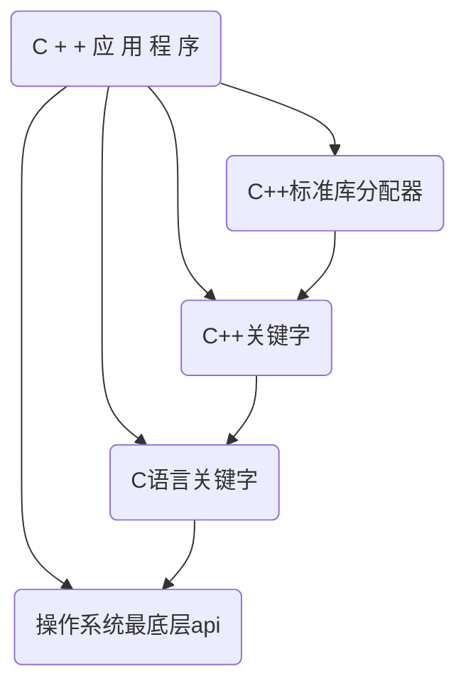

# 内存管理准备知识

## 计算机系统关于内存的函数层级

- 编程者处于C++应用程序部分
- C++标准库分配器:`std::allocator, ...`
- C++关键字:`new, new[], new(), ::operator new(), ...`
- C语言关键字:`malloc / free`
- 操作系统api:`HeapAlloc, VirtualAlloc, ...`

